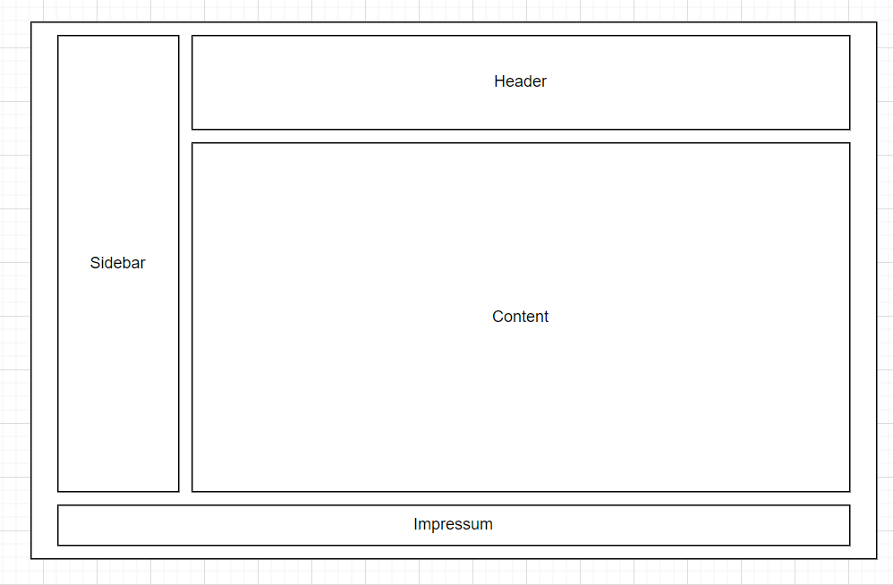

# C# A - Z

## Description
The idea of the project is a website to help people to learn C# or a tool to find nice extension for your program.

##  Main tasks
- Design a sidebar to navigate
- Write down the content
- Design content
- Combine design

## Used Source Version Control System
- Webstorm
- Github

## Members

|Name| part            |
|----|-----------------|
|Naderer David| Project Manager |
|Klewein David| Project Client  |
|Haslinger Markus| Project Client|